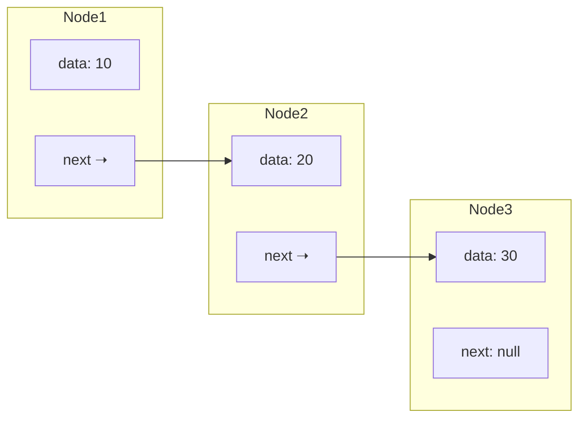

import {Code} from "@astrojs/starlight/components";
import VideoPlayer from "@components/VideoPlayer.astro"


Cái hình này khá là chuẩn đấy.
## Khái niệm
- Danh sách liên kết đơn là tập hợp tuyến tính các phần tử và dữ liệu, mà giữa chúng có dự liên kết với nhau thông qua địa chỉ.
- Cách hoạt động của danh sách liên kết là 1 node trong đó sẽ chứa giá trị và địa chỉ trỏ đến node tiếp theo, node cuối cùng có địa chỉ trỏ đến null.
- Quy tắc của cái này là bạn chỉ biết được thằng đầu tiên của list, và mỗi thằng chỉ biết tới thằng tiếp theo của nó chứ không biết toàn bộ. Đúng nghĩa của quy trách nhiệm và tư duy đỗ lỗi là từ thằng này.



Các thao tác của danh sách liên kết bao gồm:
- Khởi tạo
- Thêm node
- Xoá node
- Duyệt danh sách liên kết
- Truy xuất bằng chỉ mục

## Các thao tác với danh sách liên kết 
### Khởi tạo
Tạo 2 cấu trúc `struct`, bao gồm:
- Định nghĩa về node.
- Định nghĩa cho linked list.

#### Struct Node

Node là một struct bao gồm 2 thành phần cơ bản bắt buộc:
- Thành phần data để chứa dữ liệu.
- Thành phần next để chứa pointer tới node khác.

Và vì cần 2 cái và có thêm struct nên tôi khuyên bạn nên có thêm một constructor cho struct ~~cho nó ngầu~~.

import LinkedListcpp from "../assets/datastruct/SinglyLinkedList.cpp?raw";
import {loadLines} from "@utils/loadLines.js";

<Code code={loadLines(LinkedListcpp, 1, 5)} lang="c++" title="Node" />

Bạn có thể thấy là bên trong cái struct Node nó có chứa next là pointer `*Node`, nó sẽ trỏ tới nguyên cái node nên là nhìn nó hơi đệ quy dị dị.

#### Struct List
List cũng sẽ cần ít nhất 1 thành phần:
- Head là node đầu của list, bạn cần có thằng cầm đầu để mà biết tụi kia nó ở đâu.

Ủa thế thì cũng gọn ha. Thì đúng, chỉ cần head là được rồi nhưng mà chúng ta có thể thêm vài thành phần nữa cho dễ xài như là:
- Tail, node cuối, để dễ nhìn hơn.
- Count, biến đếm số lượng node có trong list, tuyệt vời lắm đấy.

Ở list thì các hàm cần cả constructor và destructor để tạo list và xoá các node có trong list, tránh dẫn tới tốn bộ nhớ. Cho dù tôi biết là giờ cũng không sợ lắm mà tập luyện để nhớ thì tốt hơn mà.

<Code code={loadLines(LinkedListcpp, 7, 28)} lang="c++" title="List" />

Ý tưởng của destructor là sẽ duyệt qua từng node và delete nó để giải phóng bộ nhớ.

### Tìm kiếm và truy xuất
Dễ nhất ở đây là tìm kiếm trong list. Cách làm của chúng ta sẽ là duyệt qua toàn bộ list cho tới khi bạn gặp đúng node có giá trị cần tìm.

Nghe chữ "cho tới khi" quen không? Đúng vậy, bạn sẽ dùng vòng lặp `while` để có thể duyệt qua toàn bộ list.

#### Tìm kiếm
Cách làm là bạn sẽ dùng một node tạm, gán node trùng với head, và đi duyệt qua từng cái cho tới khi gặp đúng thì thôi.

<Code code={loadLines(LinkedListcpp, 31, 38)} lang="c++" title="Search" />

:::tip[Tối ưu bộ nhớ khi truyền tham số cho hàm]
Khi bạn truyền tham số là một cấu trúc dữ liệu (string, struct) vào một hàm thì bạn nên dùng thêm ký tự `&` để máy tính không tạo thêm biến mới (hay còn gọi là pass by reference), gây tốn bộ nhớ không cần thiết và làm chậm tốc độ chạy.

Và nếu tham số của bạn không thay đổi trong hàm thì nên nhét thêm `const` vào luôn để bảo đảm bạn có code ngu thì nó cũng báo cho bạn biết ~~khả năng tôi sẽ bị chửi vì tôi code ngu khúc này mà kệ~~.
:::

#### Truy xuất
Cũng y chang luôn, nhưng truy xuất thì tham số input của bạn sẽ là chỉ số (hay là thứ tự) của node trong list thay vì là giá trị.

Bạn chỉ cần thêm một biến local để đếm trong hàm là xong.

<Code code={loadLines(LinkedListcpp, 40, 46)} lang="c++" title="Node At" />

### Thêm node
Ở đây tôi sẽ cho bạn 3 cách thêm vào 3 vị trí khác nhau.
- Thêm đầu
- Thêm cuối
- Thêm bất kỳ

#### Thêm đầu


#### Thêm 

## Ví dụ:
[Visualgo](https://visualgo.net/en/list)
<VideoPlayer src="/docs/DSA/videos/SinglyLinkedList.mp4" />

## Cài đặt
**1 node**
```c++
struct Node{
    int data;
    Node *next;
};
```

**Danh sách liên kết**
```c++
struct SinglyLinkedList{
    Node* head;
    Node* tail;
};
```


<Code code={LinkedListcpp} title="SinglyLinkedList.cpp" lang="c++" showLineNumbers="true" ins={[
    {range: "1-27", label: "Khai báo Node và List"},
    {range: "29-38", label: "Tìm kiếm"},
    {range: "40-51", label: "Truy xuất node theo index"},
    {range: "53-80", label: "Thêm node vào đầu, cuối hoặc là vị trí bất kỳ theo index"},
    {range: "82-102", label: "Xoá node tại vị trí bất kỳ"}
]} />

Với các thao tác trên thì bạn có thể tìm hiểu tại


## Stack
### Khái niệm
Là một cấu trúc dữ liệu hoạt động theo nguyên tắc **Last In, First Out (LIFO)**. Phần tử cuối cùng được thêm vào stack sẽ là phần tử đứng đầu và là phần tử bị xoá đầu tiên.

Các thao tác trên stack là:
- `push` (thêm phần tử)
- `pop` (xoá phần tử đầu)
- `top` (giá trị phần tử đứng đầu)
- `empty` (kiểm tra stack có rỗng hay không)
- `size` (chiều dài của stack)


### Ví dụ:
[Visualgo](https://visualgo.net/en/list)

### Cài đặt
Trong thư viện chuẩn của C++, ta có thể sử dụng `std::stack` để khai báo cấu trúc stack có sẵn các thao tác.

## Queue
### Khái niệm
Là một cấu trúc dữ liệu hoạt động theo nguyên tắc **First In, First Out (FIFO)**. Phần tử đầu tiên được thêm vào queue sẽ là phần tử đứng đầu và là phần tử bị xoá đầu tiên.

Các thao tác trên queue là:
- `push` (thêm phần tử)
- `pop` (xoá phần tử đầu)
- `front` (giá trị phần tử đứng đầu)
- `empty` (kiểm tra queue có rỗng hay không)
- `size` (chiều dài của queue)


### Ví dụ:
[Visualgo](https://visualgo.net/en/list)

### Cài đặt
Trong thư viện chuẩn của C++, ta có thể sử dụng `std::queue` để khai báo cấu trúc queue có sẵn các thao tác.