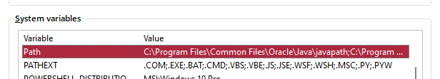

import {Steps} from "@astrojs/starlight/components";

## C++ Compiler
Có rất là nhiều compiler cho C/C++ như là bộ `gcc` hoặc `clang`, ở đây tôi hướng dẫn dùng `gcc` một cách dễ nhất.

### Windows
Trên Windows thì nhiều cách cài đặt lắm mà cho dễ thì hãy làm theo các bước sau:

<Steps>
1. Truy cập [trang này](https://github.com/skeeto/w64devkit/releases).

2. Nhìn vào chữ `Lastest`. 

3. Tìm bản phù hợp với kiến trúc máy của bạn (giờ thì chắc toàn x64 chứ không còn x86 đâu).

4. Tải file có đuôi `.exe` về.

5. Bấm vào và nó sẽ giải nén ra, bạn chọn đường dẫn đến ngay ổ C: cho tiện.

6. Bấm vào nút Start (cái nút hình Windows), ghi chữ "Edit the system variables", chọn vào cái giống hình sau 

7. Bấm vào "Environment Variables". 

8. Chọn dòng có chữ "Path" ở khu bên dưới.  và chọn Edit.

9. Chọn New và thêm đường dẫn đến thư mục `bin` của w64devkit là xong.

10. Nhấn OK các nút cho đến hết
</Steps>

### Linux - Ubuntu
Bạn xài thì phải biết dòng lệnh tuyệt vời này.

```sh 
sudo apt update
sudo apt install build-essential -y
```

Và bạn đã có tất cả những thứ bạn cần để code C++.