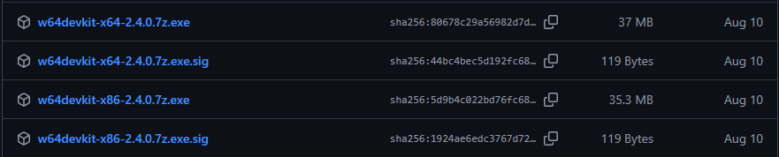
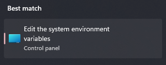

import {Steps} from "@astrojs/starlight/components";

## C++ Compiler/Debugger
Có rất là nhiều compiler cho C/C++ như là bộ `gcc` hoặc `clang`, ở đây tôi hướng dẫn dùng `g++` một cách dễ nhất.

### Windows
Trên Windows thì nhiều cách cài đặt lắm mà cho dễ thì hãy làm theo các bước sau:

<Steps>
1. Truy cập [trang này](https://github.com/skeeto/w64devkit/releases).

2. Nhìn vào chữ `Lastest`. 

3. Tìm bản phù hợp với kiến trúc máy của bạn (giờ thì chắc toàn x64 chứ không còn x86 đâu).

4. Tải file có đuôi `.exe` về.

5. Bấm vào và nó sẽ giải nén ra, bạn chọn đường dẫn đến ngay ổ C: cho tiện.

6. Bấm vào nút Start (cái nút hình Windows), ghi chữ "Edit the system variables", chọn vào cái giống hình sau 

7. Bấm vào "Environment Variables". 

8. Chọn dòng có chữ "Path" ở khu bên dưới.  và chọn Edit.

9. Chọn New và thêm đường dẫn đến thư mục `bin` của w64devkit là xong.

10. Nhấn OK các nút cho đến hết
</Steps>

### Ubuntu
Bạn nên biết dòng lệnh tuyệt vời này.

```sh 
sudo apt update
sudo apt install build-essential -y
```

### Các Distro khác
Tôi tin rằng bạn có thể tự tìm được vì bạn xài tới đây rồi

## Python Interpreter
Cái này thì dễ hơn nhiều.

### Windows
Cũng có nhiều cách, nhưng dễ nhất thì nó sẽ có trên [Windows store](https://apps.microsoft.com/detail/9NCVDN91XZQP) để cài đặt là nhanh nhất.

### Ubuntu
Cũng là một lệnh `apt` đơn giản.

```sh
sudo apt update
sudo apt install python
```

### Các Distro khác
Tương tự như trên.

## Editor
Cái này thì nhiều lắm, nhưng tôi sẽ khuyến khích bạn sử dụng [Notepad++](https://notepad-plus-plus.org/downloads/) cho các tác vụ edit thông thường thay Notepad và [Visual Studio Code](https://code.visualstudio.com/) vì nó đẹp và có nhiều extension để hỗ trợ code.

Đặc biết với các bạn mới học C++ thì bạn nên tìm hiểu về [Code::Blocks](https://www.codeblocks.org/) vì nó dễ setup và dễ sử dụng. Python thì editor nào cũng ok.

## IDE
Ủa rồi cái này là sao nữa? IDE (Integrated Development Environment) là một cái bộ nhiều công cụ tích hợp mà những thứ luôn luôn có là:
- Editor
- Compiler
- Debugger 
- ...

Vậy thì nó quá là tiện rồi, khỏi phải cài riêng lẻ từng cái đúng không? Đúng là vậy nhưng mà nó khá là nặng (quỷ Visual Studio nặng 30GB) nên là bạn có thể từ mấy cái nhẹ để dễ làm quen sẽ ok hơn.

### C++
Đối với C++ thì chắc chắn phải có [Visual Studio](https://visualstudio.microsoft.com/). Khác với cái Visual Studio Code ở trên, đây là một IDE có full tool và nó rất là mạnh, chỉ là nó quá nặng thôi. Tôi cũng không khuyến khích bạn sử dụng liền cái này ~~Trừ người thầy tên T môn M của ngành An toàn Thông tin bắt bạn tải để xài được cái compiler ra thì tôi chưa thấy quá cần thiết~~.

Code::Blocks cũng có phiên bản tích hợp sẵn bộ compiler/debugger là đi chung với MinGW. Cũng là một cách để đỡ phài cài ngoài nhưng khi bạn muốn VSCode xài chung bộ thì nó lại không hay.

VSCode, ủa cái này là editor mà? Nhưng mà nó có sẵn các extension mà bạn chỉ cần cài, config và thế là đã có luôn compiler/debugger mà không cần chạy bằng lệnh. Bạn có thể tìm hiểu tại bài viết [C/C++ for Visual Studio Code](https://code.visualstudio.com/languages/cpp).

### Python
IDE mạnh nhất và xịn nhất dành cho Python là [PyCharm](https://www.jetbrains.com/pycharm/). Nó quá nhiều ưu điểm tới mức nhược điểm của nó là trả phí và nó mắc thì thôi nhé. Nhưng đừng lo, với tài khoản mail sinh viên bạn được cấp thì bạn sẽ được free hết tới khi tốt nghiệp.

Ngoài PyCharm ra thì JetBrains cũng có rất nhiều IDE cho các ngôn ngữ khác cũng rất ngon như Java, Go, Kotlin và rất rất nhiều nữa. Tư bản này xịn.