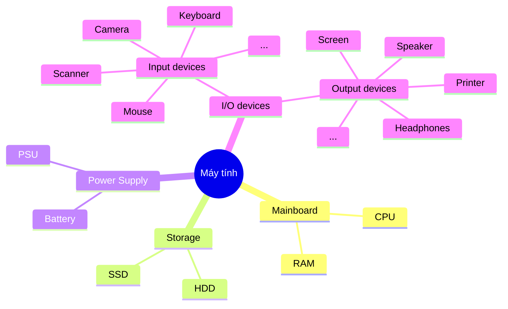
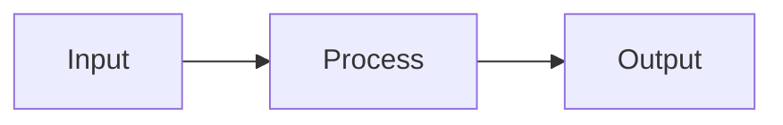

import { Card } from "@astrojs/starlight/components";

## Định nghĩa 

### Máy tính

<Card title="Máy tính" icon="laptop">
    Là cái "Máy biết tính toán".
</Card>
Thế thôi, đó là cách mà bạn cần hiểu về máy tính. Vì khi suy nghĩ đi nghĩ lại thì cuối cùng công việc của nó là xử lý các dữ liệu được "số hoá".

Máy tính làm việc với số và cách nó làm bằng các quy trình logic mà con người quy định.

"Máy tính" là cái từ gọi chung cho rất nhiều thứ, trong đó là cái laptop bạn đang xài để đọc cái bài viết này, cái điện thoại bạn sử dụng để lướt TikTok hoặc Facebook, thậm chí là cái mạch có trong máy pha cà phê cũng là máy tính. Hoặc nó to lớn như là mấy cái máy chủ game như Liên Minh Huyền Thoại hay to hơn nữa là mấy hệ thống của các công ty to để làm AI cũng là "máy tính".

Vậy thì cái máy tính đó nó chứa cái gì mà làm được nhiều trò thế? Chắc các bạn cũng tự hình dung được nhưng mà để tôi cho bạn xem cái mindmap đơn giản về các thành phần cơ bản trong máy tính ~~thật ra để tôi học cách xài mermaid~~.

Vậy thì kiểu gì cái máy tính cũng phải có 2 phần là Mainboard và Power Supply, không có thì không chạy được.

Trong máy tính thì chúng ta sẽ chia ra nhiều phần để làm việc và quản lý (chia ra nhiều ngành học nữa): 
- Hardware
- Software
- Kernel
- ...

Hardware là những gì tôi để ở trên cái mindmap. Hiện tại thì bạn chỉ cần quan tâm cho tôi về Software (Phần mềm) là được.

### Phần mềm

<Card title="Phần mềm" icon="codePen">
    Phần mềm là tập hợp các chỉ thị của người sử dụng máy tính để giao việc cho phần cứng làm việc giùm mình.
</Card>
Các công việc để cho máy tính làm thì vô vàn nên là chắc tôi không cần phải liệt kê để làm gì.

Ví dụ thì nhiều lắm, gần như cái gì bạn đang sử dụng trên máy tính mà bạn bấm hay click hay gõ trên nó thì đa số là phần mềm.

### Lập trình
Nói lan man nãy giờ thì mới về lại cái chính. Cách tôi hiểu về lập trình cũng khá là đơn giản:

<Card title="Lập trình" icon="seti:html">
    Lập trình là bạn coi máy tính là nô lệ và ra lệnh cho nó làm việc.
</Card>
Còn mà nói theo cách mà chuẩn sư phạm thì:

<Card title="Lập trình" icon="seti:html">
    Lập trình máy tính (programming): Là kỹ thuật cài đặt một hoặc nhiều thuật toán trừu tượng có liên quan với nhau bằng một hoặc nhiều ngôn ngữ lập trình để tạo ra một chương trình máy tính.
</Card>
Dài và cũng khó nhớ nên cứ nhớ theo cách của tôi có khi lại hay.

Vậy thì làm việc kiểu gì nhỉ? Nghe có vẻ xa vời nó giống như học lại toán của cấp 3 thôi. 

Nếu bạn có một hàm số $f\left(x\right) = x^2 + 5$. Bạn muốn tính được kết quả của hàm số đó với $x = 2$ thì chúng ta phải làm phép toán $f\left(2\right) = 2^2 + 5 = 9$. Vậy kết quả là $9$.

Bạn thấy đó, đối với bất kỳ con số $x$ khác nhau thì đều cho ra một kết quả khác nhau (có thể trùng mà do chúng ta muốn nó trùng). Máy tính nó cũng thế, khi chúng ta chỉ cho máy tính làm việc thì nó cũng sẽ nhận một cái đầu vào (input) và xử lý tính toán gì đó với input, sau đó nó sẽ cho ta một cái đầu ra (output) mà ta mong muốn ~~hoặc không~~.

Cho dễ hình dung thì đơn giản thế này:

Và phần lập trình của ta là dạy máy tính để thực hiện bước Process này.

## TL;DR 
Bạn sẽ hiểu được định nghĩa cơ bản của máy tính và lập trình, mời các bạn đọc tiếp các bài viết sau để hiểu được cách mà chúng ta lập trình.