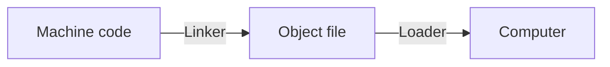
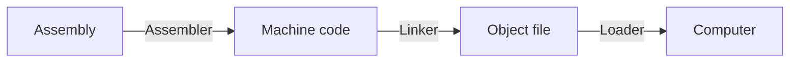
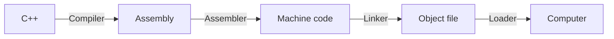
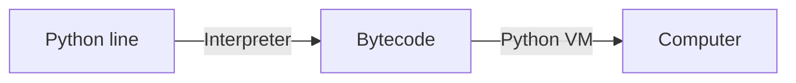

Nghe tới ngôn ngữ thì bạn sẽ nghĩ: "IELTS 8.0 là học lập trình siêu nhanh". Thì cũng có phần đúng . Bạn cần phải có chút ngoại ngữ để có thể đọc tài liệu các ngôn ngữ vì tiếng Việt về tài liệu thì nhiều nhưng chưa quá tốt nhưng nó không phải những gì mà tôi muốn ghi ở đây.


## Định nghĩa
> Ngôn ngữ lập trình là lệnh bạn muốn máy tính làm cho bạn.

Vậy thì mình phải đi học ngôn ngữ của máy tính đúng không? Đúng, nhưng mà bạn không muốn học đâu, thật đấy.

### Ngôn ngữ máy
Là ngôn ngữ mà máy tính nó hiểu, mà cái nó hiểu thì bạn không hiểu được. Tất cả chỉ là những số "0" và "1" nên là sẽ rất khó để bạn có thể đọc và viết được.

Đây là một ví dụ về mã máy để viết chữ "Hello World!":

```md title="HW.o"
b8    21 0a 00 00   #moving "!n" into eax
a3    0c 10 00 06   #moving eax into first memory location
b8    6f 72 6c 64   #moving "orld" into eax
a3    08 10 00 06   #moving eax into next memory location
b8    6f 2c 20 57   #moving "o, W" into eax
a3    04 10 00 06   #moving eax into next memory location
b8    48 65 6c 6c   #moving "Hell" into eax
a3    00 10 00 06   #moving eax into next memory location
b9    00 10 00 06   #moving pointer to start of memory location into ecx
ba    10 00 00 00   #moving string size into edx
bb    01 00 00 00   #moving "stdout" number to ebx
b8    04 00 00 00   #moving "print out" syscall number to eax
cd    80            #calling the linux kernel to execute our print to stdout
b8    01 00 00 00   #moving "sys_exit" call number to eax
cd    80            #executing it via linux sys_call
```

Hiểu gì không? Nếu bạn học đủ nhiều thì hiểu nhưng tôi thì không.

Ủa mà sao nãy tôi nói là số "0" và "1" mà giờ mã máy còn vừa số vừa chữ luôn vậy? Vì nó dài quá nên là họ đã encode thành hệ cơ số thập lục phân cho nó gọn, bạn muốn tìm hiểu có thể đọc bài [Hệ cơ số](/docs/nmlt/base).

Vậy là hiện tại cách để ra lệnh cho máy tính là:


Bạn chưa cần phải hiểu về Linker với Loader đâu, vì nó chưa cần thiết.

Biết được sự kinh khủng đó nên các nhà phát triển đời đầu đã tạo ra một loại ngôn ngữ để con người có thể hiểu được một phần là **Hợp ngữ** (Assembly).


### Hợp ngữ 
Assembly là cái đoạn code mà bạn vừa đọc nhưng mà phiên bản dễ hiểu hơn một chút. Thay vì bạn phải ghi những ký tự khó hiểu như mã máy thì bây giờ nhà phát triển họ đã thêm một bộ "từ điển" để bạn viết bằng ngôn ngữ giống tiếng Anh, ngôn ngữ đó là Assembly.

Ví dụ cho Assembly:

```asm title="HW.asm"
section .data
    ; Define the message string and a newline character (0xa)
    msg db 'Hello, World!', 0xa
    ; Calculate the length of the message automatically
    len equ $ - msg

section .text
    global _start

_start:
    ; --- sys_write syscall ---
    ; This one system call writes the string to the console.

    mov eax, 4          ; Syscall number for sys_write
    mov ebx, 1          ; File descriptor for stdout
    mov ecx, msg        ; Pointer to the message (using the label)
    mov edx, len        ; Length of the message (using the calculated value)
    int 0x80            ; Call the kernel to execute the write

    ; --- sys_exit syscall ---
    ; This exits the program.

    mov eax, 1          ; Syscall number for sys_exit
    xor ebx, ebx        ; Exit code 0 
    int 0x80            ; Call the kernel to execute the exit
```

Và để bộ "từ điển" để dịch từ Assembly sang mã máy ta gọi là "Assembler". Bạn cũng chưa cần hiểu quá về nó đâu.

Lúc này các bước từ Assembly tới lệnh là:


Bạn thấy ở trên rồi đó, nó vấn quá là khó hiểu. Nên là con người lại nghĩ một cách tiếp cận mới hay ta gọi là "Ngôn ngữ lập trình bậc cao", ví dụ ở đây là C++.

### C++

Ở giai đoạn này, cái thứ bạn viết ra cho máy tính làm thì cũng gần hơn với con người nên là bạn dễ dàng đọc và viết chương trình bằng các ngôn ngữ bậc cao. Tới đây thì dễ lắm rồi.

Ví dụ cho bạn:

```cpp wrap title="HW.cpp"
#include <iostream> //thư viện chứa nhập xuất chuẩn
using namespace std; //các lệnh nhập xuất đều nằm trong bộ thư viện chuẩn (standard library)

int main(){
    cout << "Hello World!"; //thế này thôi
    return 0;
}
```

Đẹp và gọn gàng hẳn ra. Tôi khuyên bạn bắt đầu học lập trình bằng C++, vì nó vừa đủ dễ để viết nhưng vẫn đầy đủ các thành phần cần thiết trong 1 chương trình, không bị đơn giản hoá quá mức như Python hay JavaScript.

Và để có thể giúp C++ chạy được thì chúng ta có trình biên dịch (Compiler). Nó được sinh ra để dịch thành Assembly.



### Python
Đây rồi, chắc nhiều bạn mong muốn đọc tới đây nhất nên có thể skip qua mấy đoạn trên, mà tôi khuyên bạn vẫn nên đọc để hiểu chứ đừng bỏ, nó vui lắm.

Lần này thì đây là ngôn ngữ mà được gọi là nhóm "Scripting languages". Nó có thể chạy theo từng dòng lệnh riêng biệt mà không cần phải có một cấu trúc chương trình đầy đủ nên là nó gọn, nhanh khủng khiếp.

```python title="HW.py"
print("Hello World!")
```

Tất nhiên nhược điểm là khi bạn học cái này trước thì bạn sẽ thấy học các ngôn ngữ khác trở nên khó khăn hơn.

Python được thiết kế bởi trình thông dịch (Interpreter) để dịch sang bytecode và chạy bằng một cái máy ảo. Nghe hơi lạ nhưng không cần quan tâm quá nhiều đâu.



Gọn lắm nhưng mà chưa chắc đã xịn đâu.

## Còn gì nữa
Bài viết tiếp theo tôi sẽ hướng dẫn các bạn cài đặt các công cụ cần thiết như compiler của C++ hay interpreter của Python để bắt đầu vào code.